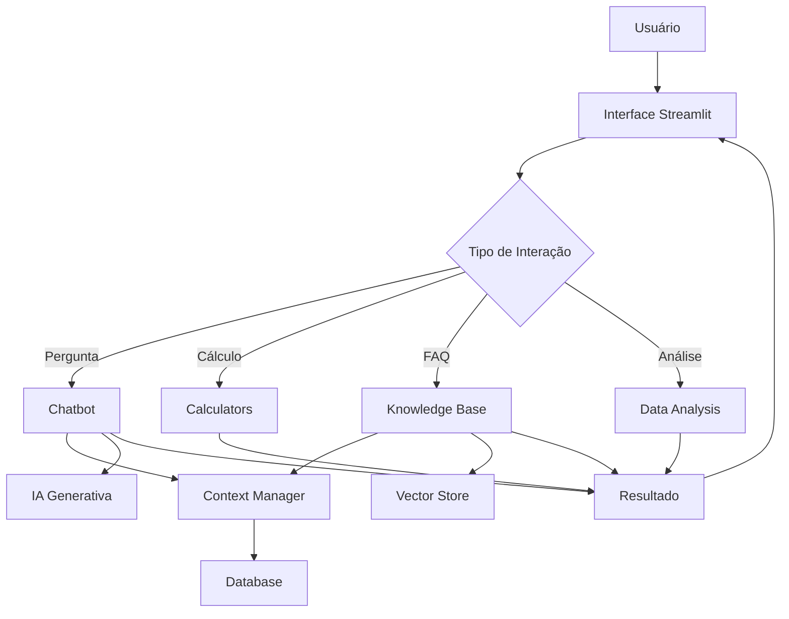

# 🏗️ Arquitetura do Sistema

## Visão Geral

O Assistente Financeiro é construído com uma arquitetura modular, permitindo escalabilidade e manutenção facilitada.

## Componentes Principais

### 1. Interface do Usuário (Streamlit)
```
┌─────────────────────────────────┐
│      Interface Streamlit        │
│  (app.py)                       │
└────────────┬────────────────────┘
             │
             ▼
```

### 2. Camada de Aplicação
```
┌─────────────────────────────────┐
│   src/                          │
│   ├── chatbot/                  │
│   ├── calculators/              │
│   ├── knowledge_base/           │
│   ├── data_analysis/            │
│   ├── database/                 │
│   └── utils/                    │
└─────────────────────────────────┘
```

### 3. Módulos

#### Chatbot
- **Função**: Processamento de linguagem natural
- **Tecnologias**: OpenAI GPT / Google Gemini, LangChain
- **Responsabilidades**:
  - Compreensão de intenções
  - Geração de respostas contextualizadas
  - Manutenção do histórico de conversação

#### Calculators
- **Função**: Cálculos financeiros
- **Tecnologias**: NumPy, Pandas
- **Responsabilidades**:
  - Simulações de financiamento
  - Cálculos de investimento
  - Projeções financeiras

#### Knowledge Base
- **Função**: Base de conhecimento e FAQs
- **Tecnologias**: Embeddings, Vector Store
- **Responsabilidades**:
  - Armazenamento de conhecimento
  - Busca semântica
  - Recuperação de informações

#### Data Analysis
- **Função**: Análise e visualização de dados
- **Tecnologias**: Pandas, Plotly
- **Responsabilidades**:
  - Processamento de dados
  - Geração de gráficos
  - Insights automatizados

#### Database
- **Função**: Persistência de dados
- **Tecnologias**: SQLite
- **Responsabilidades**:
  - Gerenciamento de sessões
  - Histórico de conversações
  - Preferências do usuário

#### Utils
- **Função**: Utilitários compartilhados
- **Responsabilidades**:
  - Validações
  - Formatação
  - Helpers diversos

## Fluxo de Dados



## Segurança

### Camadas de Segurança

1. **Autenticação e Autorização**
   - Validação de credenciais
   - Controle de acesso baseado em perfis

2. **Criptografia**
   - Dados sensíveis em repouso
   - Comunicação via HTTPS

3. **Conformidade LGPD**
   - Consentimento explícito
   - Direito ao esquecimento
   - Portabilidade de dados

## Escalabilidade

### Estratégias

- **Horizontal**: Múltiplas instâncias da aplicação
- **Cache**: Redis para respostas frequentes
- **CDN**: Distribuição de assets estáticos
- **Load Balancing**: Distribuição de carga

## Monitoramento

- **Logs**: Estruturados em JSON
- **Métricas**: Tempo de resposta, taxa de erro
- **Alertas**: Notificações automáticas

## Tecnologias

| Componente | Tecnologia |
|------------|------------|
| Backend | Python 3.9+ |
| Frontend | Streamlit |
| IA | OpenAI GPT / Google Gemini |
| Banco de Dados | SQLite |
| Análise | Pandas, NumPy |
| Visualização | Plotly |
| Testes | Pytest |

## Próximos Passos

- [ ] Integração com Open Banking
- [ ] API RESTful
- [ ] Aplicativo mobile
- [ ] Dashboard administrativo